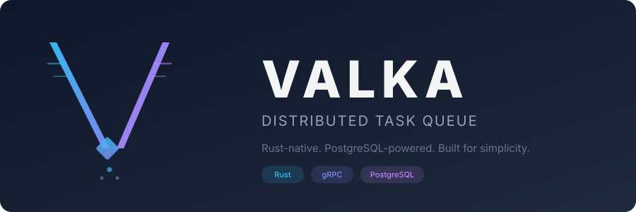

<p align="center">
  
</p>

<p align="center">
  <strong>A Rust-native distributed task queue with a write-ahead log on object storage.</strong><br/>
  One bucket. Zero databases. Zero brokers. Nodes you can kill.
</p>

<p align="center">
  <a href="#quick-start">Quick Start</a> &bull;
  <a href="#sdks">SDKs</a> &bull;
  <a href="#architecture">Architecture</a> &bull;
  <a href="#web-dashboard">Dashboard</a> &bull;
  <a href="#deployment">Deployment</a>
</p>

<p align="center">
  
</p>

---

## Why Valka?

Most task queues bolt together a message broker, a database, and a cache. Every moving part is another thing to deploy, monitor, and debug at 3 AM.

**Valka takes a different approach.** An S3-compatible bucket is the single source of truth: every state transition is appended to a write-ahead log, group-committed to the bucket, and nothing is acknowledged before it lands there. Nodes hold only rebuildable RAM state, so any node can be killed at any time and a fresh one rebuilds itself from snapshots plus the WAL tail. An in-memory matching engine and gRPC bidirectional streaming replace the message broker entirely.

- **One dependency.** If you have a bucket (S3, MinIO, R2, or a local directory), you can run Valka.
- **Diskless, disposable nodes.** Acked = durable in the bucket, 11 nines of durability, no replication to operate.
- **Free history and CDC.** The WAL is plain zstd-compressed JSON; anything can tail it straight from the bucket.
- **Zero-latency hot path.** Tasks are matched to waiting workers in-memory — no polling.
- **Polyglot.** Rust, TypeScript, Go, and Python SDKs. Or just use the REST API.
- **Observable.** Real-time log streaming, event feeds, Prometheus metrics, and a web dashboard out of the box.

## Features

- Write-ahead log on object storage: group commit, per-shard snapshots, exact replay
- In-memory task matching fed from a RAM pending index (no polling, no DB on the hot path)
- gRPC bidirectional streaming (single connection per worker, no polling)
- 4096 fixed storage shards with single-writer ownership (multi-node takeover: phase 2, see `docs/wal/PLAN.md`)
- Task signals — send real-time signals to running workers
- Automatic retries with exponential backoff + dead letter queue
- Structured log streaming per task run
- Event broadcasting via gRPC streams and SSE
- Idempotency keys, task cancellation, scheduled/delayed tasks
- Web dashboard, CLI, and Prometheus metrics
- Graceful shutdown for both server and workers

## Quick Start

```bash
# 1. Start the server against a local directory (./data). No services needed.
cargo run -p valka-server

#    ...or against MinIO (S3-compatible):
#    docker compose up -d minio minio-init
#    VALKA_STORAGE__BACKEND=s3 VALKA_STORAGE__BUCKET=valka \
#    VALKA_STORAGE__ENDPOINT=http://localhost:9000 VALKA_STORAGE__ALLOW_HTTP=true \
#    VALKA_STORAGE__ACCESS_KEY_ID=minioadmin VALKA_STORAGE__SECRET_ACCESS_KEY=minioadmin \
#    cargo run -p valka-server

# 3. Run a worker
cargo run -p valka-examples --example worker

# 4. Create tasks
cargo run -p valka-examples --example producer
```

The server starts on **gRPC `:50051`** and **REST `:8989`**.

## SDKs

| Language | Package | Install |
|----------|---------|---------|
| **Rust** | `valka-sdk` | `cargo add valka-sdk` |
| **TypeScript** | `@valka/sdk` | `npm install @valka/sdk` |
| **Go** | `github.com/valka-queue/valka/sdks/go` | `go get github.com/valka-queue/valka/sdks/go` |
| **Python** | `valka` | `pip install valka` |

Any language can also interact via the REST API.

### Rust

```rust
let worker = ValkaWorker::builder()
    .name("email-worker")
    .server_addr("http://localhost:50051")
    .queues(&["emails"])
    .concurrency(8)
    .handler(|ctx: TaskContext| async move {
        let input: serde_json::Value = ctx.input()?;
        // ... do work ...
        Ok(serde_json::json!({"status": "delivered"}))
    })
    .build()
    .await?;

worker.run().await
```

### TypeScript

```typescript
const worker = new ValkaWorker({
  name: "email-worker",
  serverAddr: "localhost:50051",
  queues: ["emails"],
  concurrency: 8,
  handler: async (ctx) => {
    console.log(`Processing: ${ctx.taskName}`);
    return { status: "delivered" };
  },
});
await worker.run();
```

## Architecture

```
                    ┌─────────────────────────────────────────────────┐
                    │                  VALKA NODE                     │
  REST clients ───► │  REST API ──┐                                   │
  gRPC clients ───► │  gRPC API ──┴──► Engine (4096 shard state       │
                    │                  machines in RAM)               │
                    │                    │  validate → apply → append  │
                    │                    ▼                            │
                    │            WAL buffer (RAM, unacked only)       │
                    │                    │ group commit 50 ms / 4 MB   │
                    │                    ▼                            │
                    │      ┌─────────────────────────────────┐        │
                    │      │  BUCKET — the only truth        │        │
                    │      │  wal/{node}/{epoch}-{seq}.seg   │        │
                    │      │  snapshots/{shard}/{lsn}.snap   │        │
                    │      │  logs/{run}/…   assignment      │        │
                    │      └─────────────────────────────────┘        │
                    │                    │ ack ← durable                │
                    │   pending index ──► MatchingService ──► Dispatcher│
                    │   timer wheel       (partition tree)   (gRPC bidi)│
                    │   (leases, retries, delayed)                │    │
                    └─────────────────────────────────────────────┼────┘
                                                                  │
                                              ┌───────────────────┼─────────────┐
                                              ▼                   ▼             ▼
                                          Worker A            Worker B      Worker C
                                         (Rust SDK)          (Go SDK)    (Python SDK)
```

Crash recovery: a new node loads the newest snapshot per shard, replays the WAL tail
(exact, via per-shard sequence numbers), re-arms leases and timers, and serves. Workers
keep executing throughout and reconnect. Full design: [`docs/wal/DESIGN.md`](docs/wal/DESIGN.md).

### Task Lifecycle

```
PENDING ──► DISPATCHING ──► RUNNING ──┬──► COMPLETED
                                      ├──► FAILED
                                      └──► RETRY ──┬──► PENDING (rescheduled)
                                                    └──► DEAD_LETTER (exhausted)
CANCELLED (via API at any time)
```

## Web Dashboard

Valka ships with a built-in React dashboard at the root path.

```bash
cd web && npm install && npm run dev  # Dev server on :5173
```

Pages: Dashboard, Tasks, Task Detail (runs, logs, signals), Workers, Events, Dead Letters.

## Deployment

### Docker Compose (recommended)

```bash
docker compose up
```

Starts MinIO + Valka server. REST + Dashboard on `:8989`, gRPC on `:50051`, MinIO console on `:9001`.
For production, point `[storage]` at a real bucket and drop the MinIO services.

### From Source

```bash
cargo build --release --workspace
./target/release/valka-server
```

### Configuration

Layered via [figment](https://github.com/SergioBenitez/Figment): defaults → `valka.toml` → env vars.

| Variable | Default | Description |
|----------|---------|-------------|
| `VALKA_STORAGE__BACKEND` | `local` | `s3`, `local` (directory), or `memory` |
| `VALKA_STORAGE__PATH` | `./data` | Directory for the `local` backend |
| `VALKA_STORAGE__BUCKET` | `valka` | Bucket for the `s3` backend |
| `VALKA_STORAGE__ENDPOINT` | — | Custom S3 endpoint (MinIO, R2). Omit for AWS |
| `VALKA_NODE_ID` | random | Stable node id; a node replays its own WAL on restart |
| `VALKA_WAL__FLUSH_INTERVAL_MS` | `50` | Group-commit window (enqueue ack latency) |
| `VALKA_GRPC_ADDR` | `0.0.0.0:50051` | gRPC listen address |
| `VALKA_HTTP_ADDR` | `0.0.0.0:8989` | REST/HTTP listen address |
| `RUST_LOG` | `valka=info,tower_http=info` | Log level filter |

## Roadmap

### Done

- [x] Core task queue with retry and dead letter queue
- [x] gRPC bidirectional streaming workers
- [x] REST API + CLI + Web dashboard
- [x] Real-time event and log streaming
- [x] Task signals (send signals to running workers)
- [x] Polyglot SDKs — Rust, TypeScript, Go, Python
- [x] Object-storage WAL: diskless nodes, snapshots, exact replay, fault-injected tests

### Up Next

- [ ] Multi-node shard ownership: CAS'd assignment, epochs, takeover, worker re-handshake (phase 2)
- [ ] Task priorities and weighted fair queuing
- [ ] Cron / recurring task scheduling
- [ ] Rate limiting per queue
- [ ] Task batching

## License

Apache License 2.0 — see [LICENSE](LICENSE) for details.
